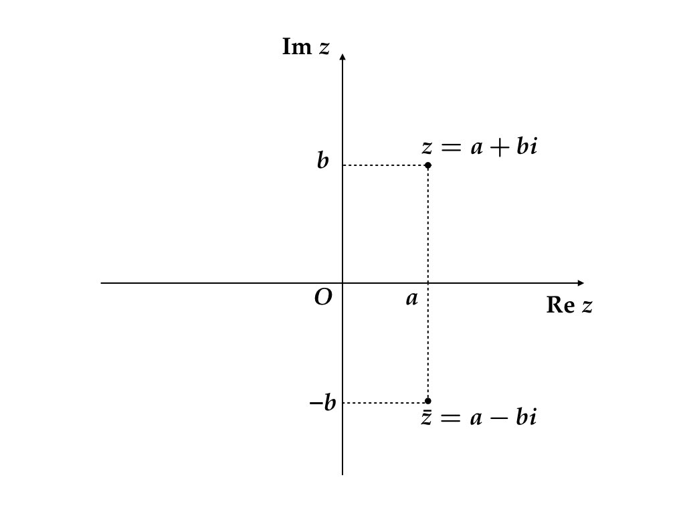

# 複素数 {#complexnumbers}

## はじめに

マクロ経済学の導入的なトピックとして1セクターの最適成長理論を学び，その後，多セクターモデルを学ばないというケースもあるかもしれない。1セクターモデルの典型的な成長経路は単調であり，[補遺](#complexramsey)で詳しく説明するように，このようなケースで複素数を考える必要はない。しかし，応用上用いられるモデルの多くは複数のセクターと多数の内生変数によって構成されるため，1セクターモデルのように単純な成長経路を描かない可能性がある。例えば，ある1点の周りを回転しながらその点に接近するような経路を描くような動学経路を表現するには，実数を考えるだけでは難しい。経済モデルの動学を理解するには複素数の取扱いが必須なのである^[もちろんこれは経済変数が複素数値を取るということを意味しているのではない。実数パラメータのみで記述されるモデルに同等な変形を施して複素数値が現れる場合には，必ずその共役複素数が同時に現れ，虚数部分を打ち消すように作用する]。

この節は，経済学の学習の中で複素数に出会ったことのない人を対象とした入門的なトピックを扱っている。上記のような話を具体的なモデルの中で説明できる読者は読み飛ばしても構わない。あるいは，マクロ経済学が未修であって行列の標準化の理論に明るい読者は[補遺](#complexramsey)まで読み飛ばしてもよい。

## 複素数

実数 (real number) の集合を $\mathbb R$ と書く。$\mathbb R$ に含まれない「数」を1つ追加し，四則演算を自由にできるようにしたものが複素数 (complex number) の集合 $\mathbb C$ になる。

追加する数は**虚数単位 (imaginary unit)**と呼ばれる。これは 
$$
  i^2 + 1 = 0
$$
を成り立たせる $i$ のことである。実際にはそのような $i$ は複数ある (かもしれない) ので，そのうちの1つに $i$ という名前をつける。実数の範囲にはこのような数は存在しないから，$i$ の追加によって $\mathbb R$ より大きい集合を考えることになる.^[2次関数 $x \mapsto x^2$ のグラフを考えてみればよい.] 

```{definition}
**複素数 (complex number)** とは，実数 $a$，$b$ を用いて 
$$
  a + bi
$$
と書ける数のことをいう。$a$ を**実部 (real part)**，$b$ を**虚部 (imaginary part)** という。
```

いつも $a + bi$ のように書くと読みにくいので，$z \in \mathbb C$ に対して,
$$
   \mathrm{Re}~z = a，\qquad \mathrm{Im}~z = b
$$
のような書き方をする.

複素数同士の四則演算を次のように定義する.

```{definition}

任意の $a_1，a_2，b_1，b_2 \in \mathbb R$ に対して,
$$
\begin{aligned}
  (a_1 + b_1 i) + (a_2 + b_2 i) &= (a_1 + a_2) + (b_1 + b_2) i \\
  (a_1 + b_1 i) - (a_2 + b_2 i) &= (a_1 - a_2) + (b_1 - b_2) i \\
  (a_1 + b_1 i) (a_2 + b_2 i) &= 
            (a_1 a_2 - b_1 b_2) + (a_1 b_2 + a_2 b_1 ) i.
\end{aligned}
$$ 

$a_2 \neq 0$ または $b_2 \neq 0$ であれば， 

$$
\begin{aligned}
  \frac{a_1 + b_1 i}{a_2 + b_2 i}
    = 
    \left( \frac{a_1 a_2 + b_1 b_2}{a_2^2 + b_2^2} \right)
    +
    \left( \frac{- a_1 b_2 + a_2 b_1}{a_2^2 + b_2^2} \right) i.
\end{aligned}
$$

```

## 複素平面（imaginary plane）

1つの複素数は $(a, b)$ という実数のペアと同一視できるので，平面上の1点として複素数を表現できる。
図\@ref(fig:imaginary-plane) 参照。

```{r imaginary-plane, fig.cap="複素平面", echo=FALSE}

```

複素平面は動学の分析に重要な役割を果たすので自ら図を描いて手になじませておくとよい。

## R コード

R では複素数を簡単に使うことができる。例えば次のように書くと，`z` という名前の**変数**に $5 + i$ という複素数を代入するという意味になる。コンソールで実行してみてほしい.

```{r}
z = 5 + 1i
z
```

```{block2, type='exercise'}
上のコードを次のように書き換えると正しく動くだろうか？何が起こるかを予想する。その後，Rコンソールで実行して予想した結果と比べる.

- `1` と `i` の間にはスペースを入れる.
- `1` を省略して `5 + i` と書く.

```

#### 実部 {-}

複素数を代入した変数をもっていれば，関数 `Re()` によってその実部を取得できる。

```{r}
Re(z)
```

#### 虚部 {-}

`Im()` によって虚部を取得できる.

```{r}
Im(z)
```


### 四則演算 {-}

四則演算も通常の数と同じようにできる。

#### 加算 {-}

```{r}
w = 4 - 3i
z + w 
```

#### 減算 {-}

```{r}
z - w
```

#### 乗算 {-}

```{r}
z * w
```

#### 除算 {-}

```{r}
z / w
```

#### 実数との演算 {-}

実数と複素数の演算も自然に行うことができる。結果は常に複素数になる。

```{r}
10 + z
```

#### 注意 {-}

R はゼロで割ってもエラーにならない。

```{r}
z / 0
```

```{r}
z / (0 + 0i)
```

次の結果は複素数になるが

```{r}
z * 0
```

次の結果は真値を返す。

```{r}
z * 0 == 0
```


### 複素平面上の図示 {-}

#### ggplot2 による作図の基本 {-}

base R の `plot()` 関数は複素数に対応しているが，残念ながら `ggplot2` はそのようにはできていない。とは言え `ggplot2` の方が強力なので，`ggplot2` のイディオムを習得してほしい。

まず実部と虚部を分けてデータフレームに保存しておく。base R の `data.frame()` ではなく `tidyverse` パッケージ (`tibble` パッケージ) の `tibble()` を用いる。本書では tibble データフレーム（tbl_df）もデータフレームと呼ぶ。

```{r}
points = 
  tibble(z = c(z, w, z / w)) %>% 
  mutate(re = Re(z), im = Im(z))
points
```

今作ったデータフレームの `re` 列を横軸に，`im` 列を縦軸にプロットすればよい。

```{r}
ggplot(points) + geom_point(aes(x=re, y=im, color=factor(z))) + 
  coord_fixed() + xlim(-5, 5) + ylim(-5, 5) # この行は装飾
```

#### べき乗 {-}

上の方法をもう少し進めてみよう。同じ複素数を繰り返し掛けるとどうなるだろうか。
$$
  z_p = 0.5 + 0.5i
$$
として，$z_p^n$ を計算する。ただし，$z_p^n$ は $z_p$ のべき乗で，実数と同様 $z_p^0 = 1$，$z_p^n = z_p z_p^{n-1}$，$n > 1$ と定義する^[（正の）実数と同様に非整数べきも定義できるが，この講義では使わない。]。

```{r}
zp = 0.5 + 0.5i
zn = tibble(re = Re(1), im = Im(1), n = 0)

for (i in 1:10) {
  zn = zn %>% add_row(re = Re(zp ^ i), im = Im(zp ^ i), n = i)
}

ggplot(zn) + geom_point(aes(x=re, y=im, color=factor(n))) + 
  coord_fixed() + xlim(-1.02, 1.02) + ylim(-1.02, 1.02)
```

$1$ に $0.5 + 0.5i$ を繰り返し掛けると次第に原点に近づいていくことが分かる。これは，実部・虚部ともに $0.5$ という比較的小さな数字だから成り立ちそうな気がする。実数の場合，$\lim_{n\to \infty} a^n = 0$ となるのは，$-1 < a < 1$ の場合ということを思いだしてほしい。複素数の場合には，実部・虚部のそれぞれが$1$ より小さい絶対値を持てば原点に収束するだろうか？

例えば次の例を考えてみよう。
$$
  z_q = 0.9 + 0.9i
$$
はたして $z_q^n$ は原点に収束するだろうか？

```{r}
zq = 0.9 + 0.9i
zm = tibble(re = Re(1), im = Im(1), n = 0)

for (i in 1:10) {
  zm = zm %>% add_row(re = Re(zq ^ i), im = Im(zq ^ i), n = i)
}

ggplot(zm) + geom_point(aes(x=re, y=im, color=factor(n))) + 
  coord_fixed() + xlim(-12, 12) + ylim(-12, 12)
```

上の図を見る限り，回転しながらどんどん原点から離れていっているようだ。原点への収束，原点からの乖離はどのような条件で特徴付けられるだろうか。

## 極形式

複素数のべき乗を計算するということは $1$ に同じ複素数を繰り返し掛けることに外ならない。その結果として，上で描いた2つの図のように回転と拡大・縮小という現象を確認することができた。

複素数 $z = a + bi$ を平面上の点 $(a, b)$ とみなせるというのが，複素平面を描いた際に念頭に置いていた事実であった。さらに平面上の点 $(a, b)$ は原点からの距離と 矢線ベクトル $(1, 0)$ を基準とした回転角で表せるということを思い出してほしい。つまり，ある $0 \le \theta < 360^\circ$ が存在して次の等式が成立する.
$$
\begin{aligned}
  a = \sqrt{a^2 + b^2} \cos \theta\\
  b = \sqrt{a^2 + b^2} \sin \theta\\
\end{aligned}
$$

$r = \sqrt{a^2 + b^2}\ge 0$ を $z = a + bi$ の**絶対値 (absolute value)**という。$z$ の絶対値を $|z|$ で表す。$\theta$ を**偏角 (argument)** という ($\mathrm{arg}(z)$ で表すこともある)。すべての複素数が
$$
  z = r(\cos\theta + i\sin\theta)
$$
という表現を持つ。この表現を複素数の**極形式 (polar form)**という。図\@ref(fig:polar-form) 参照。

```{r polar-form, fig.cap="極形式", echo=FALSE}
knitr::include_graphics("figures/02-complex_numbers/02-complex_numbers.002.jpeg")
```


絶対値が$1$ で偏角の異なる2つの複素数 $\cos\theta_1 + i\sin\theta_1$ と $\cos\theta_2 + i\sin\theta_2$ を掛け合わせると
\begin{align}
  &(\cos\theta_1 + i\sin\theta_1)(\cos\theta_2 + i\sin\theta_2) \notag \\
  &\qquad=
  (\cos\theta_1 \cos\theta_2 - \sin\theta_1\sin\theta_2)
  +
  i(\sin\theta_1\cos\theta_2 + \cos\theta_1\sin\theta_2) \notag \\
  &\qquad=
  \cos(\theta_1 + \theta_2) + i\sin(\theta_1 + \theta_2) (\#eq:polar)
\end{align}
を得る.^[加法定理を使った.] 絶対値が$1$でない場合にも，$r_1, r_2 > 0$ として,
$$
\begin{aligned}
  r_1(\cos\theta_1 + i\sin\theta_1)\cdot r_2(\cos\theta_2 + i\sin\theta_2)
  =
  r_1 r_2 \left[
    \cos(\theta_1 + \theta_2) + i\sin(\theta_1 + \theta_2)
  \right]
\end{aligned}
$$
つまり，複素数 $r_2(\cos\theta_2 + i\sin\theta_2)$ を掛けるという操作は，絶対値を $r_2$ 倍に伸縮し，偏角を $+\theta_2$ だけ回転させる作用がある。


#### オイラーの公式 {-}

式\@ref(eq:polar) は複素数の積が偏角の和に相当することを述べている。この等式を眺めて指数関数との関連性に気がつく人もいるかもしれない。実際，
\begin{align}
  e^{i\theta} = \cos\theta + i\sin\theta (\#eq:euler)
\end{align}
と定義すれば，指数法則
$$
  e^{i\theta_1} e^{i\theta_2} = e^{i(\theta_1 + \theta_2)}
$$


によって，式\@ref(eq:polar) を「導出」できる。本来は，$e^{i\theta}$ が意味するところをきちんと定義して，等式 \@ref(eq:euler) を証明する必要があるだろうが，ここでは記号として「オイラーの公式」を紹介した。関心のある読者は適当な複素関数論の教科書を読めばよい。

すべての複素数が
\begin{equation}
  z = re^{i\theta}, \quad r \ge 0,\ 0^\circ \le \theta < 360^\circ
\end{equation}
という表現を持つということを知っていればよい。なお, この表現は次のようにして, $\theta < 0^\circ$, $\theta \ge 360^\circ$ に拡張することができる: 任意の $\theta$ に対して, $\theta = \theta_0 + n \times 360^\circ$ なる整数 $n = 0, \pm 1, \pm 2, \dots$ がたった1つだけ存在する。$e^{i360^\circ} = 1$ に注意すれば, 
\begin{equation}
  e^{i\theta} = e^{i\theta_0}\left(e^{i360^\circ}\right)^n = e^{i\theta_0}
\end{equation}
を得る。

#### べき乗 {-}

以上の準備の下で, 
$$
\begin{aligned}
  \lim_{n\to\infty} z_p^n  = (0.5 + 0.5i)^n \to 0,
  \quad \text{and}\quad
  \lim_{n\to\infty} z_q^n = (0.9 + 0.9i)^n \not\to 0
\end{aligned}
$$
について説明することができる。

極形式による表現
$$
\begin{aligned}
  z_p = r_p e^{i\theta_p}\\
  z_q = r_q e^{i\theta_q}
\end{aligned}
$$
によれば, 
$$
\begin{aligned}
  r_p = \sqrt{0.5^2 + 0.5^2} \simeq `r sqrt(0.5^2 + 0.5^2)` < 1\\ 
  r_q = \sqrt{0.9^2 + 0.9^2} \simeq `r sqrt(0.9^2 + 0.9^2)` > 1.
\end{aligned}
$$
したがって, 
$$
\begin{aligned}
  |z_p^n| &= |r_p^n e^{i n\theta_p}| = r_p^n \to 0\\
  |z_q^n| &= |r_q^n e^{i n\theta_q}| = r_q^n \to \infty
\end{aligned}
$$
を得る。この観察をまとめておこう。

```{block2, type="fact"}
- $|z| < 1$ ならば $\lim_{n\to\infty} |z^n| = 0$,
- $|z| > 1$ ならば $\lim_{n\to\infty} |z^n| = \infty$,
- $|z| = 1$ ならば 任意の $n$ について $|z^n| = 1$.

```

べき乗の収束性（安定性）は考えている複素数が複素平面上で原点を中心とする単位円（unit circle）の内側（単位円盤 unit disk の上）にあるかどうかで決まる。図\@ref(fig:unit-disk)において，$z_1$のべきは発散し，$z_2$のべきは原点に収束する。

```{r unit-disk, fig.cap="単位円", echo=FALSE}
knitr::include_graphics("figures/02-complex_numbers/02-complex_numbers.003.jpeg")
```


## 共役複素数

複素数 $z = a + bi$ に対して, $\bar z = a - bi$ を**共役複素数 (complex conjugate)**あるいは**複素共役**という。$z$ は $\bar z$ の共役複素数であるから, 
\begin{equation*}
  \bar{\bar z} = z 
\end{equation*}
が成り立つ。（\@ref(fig:conjugate））


```{r conjugate, fig.cap="共役複素数", echo=FALSE}

```


共役複素数には次の性質がある。
```{block2, type="exercise"}
任意の複素数 $z$ に対して, 
$$
  z\bar z = |z|^2
$$
を示せ。
```


R では, `Conj()` で複素共役を, `abs()` で複素数の絶対値を計算できる.

```{r}
z
Conj(z)
abs(z)
```

先程の練習問題の性質は `z * Conj(z)` と `abs(z) ^ 2` の差が十分ゼロに近いことで確認できる。

```{r}
z * Conj(z) - abs(z) ^ 2
```

`e-15` というのは，`10^{-15}` を意味しているので，大変小さい数字であることが分かるだろう。あるいは，次の様にすればよい.

```{r}
all.equal(z * Conj(z), abs(z)^ 2 + 0i)
```

計算機上の小数 (浮動小数点数) は実数を有限近似したものに過ぎないので等号で評価することはできない。有限の長さを持つように見えるありきたりな有理数でさえ，等号による評価はあてにならない。例えば次のような例がある.　

```{r}
sum = 0
for (i in 1:10) {
  sum = sum + 0.1
}
sum == 1
```

0.1 を 10回足しても 1 にはならない。小数の比較に `==` を用いてはいけない。

<!--


-->

#### 多項式方程式の解 {-}

後ほど明らかになるように，線形システムは固有多項式と呼ばれる実係数多項式を「因数分解」する問題を通じて分析される。あるいは，
本質的には同じことだが，実係数多項式方程式の解（根 root）を調べる^[解 (solution) という言葉は方程式 
$f(x)=0$ を成り立たせるすべての $x$ の集合を指し，根（root）は $f(x_0) = 0$ となる数 $x_0$
のことを指して，区別することが多い。]。いずれにせよ実係数多項式方程式が重要な役割を果たす。

多項式方程式は次のような性質を持つ。
```{theorem, label="fundamental-theorem-algebra", name = "代数学の基本定理"}
$a_n, \dots, a_0 \in \mathbb C$ とする。$z$ の多項式
$$
  p(z) = a_n z^n + a_{n-1} z^{n-1} + \cdots + a_1 z + a_0
$$
は，複素数の範囲で（重根を重複度の回数数えれば）ちょうど $n$ 個の根（root）をもつ。　 
```

適当な代数学・複素関数論の本を参照のこと。複素係数の多項式方程式の解は必ず複素数に含まれる。
この性質をもって $\mathbb C$ は**代数的閉体**であると言われる^[その集合の元を係数とする多項式方程式の解がその集合に含まれる。
実係数方程式 $x^2 + 1 =0$ は実数根を持たないので，実数は代数的閉体ではない。]。 

実数係数多項式方程式が複素根をもつ時，その共役複素数もまた根である。

```{theorem}
$a_n, \dots, a_0 \in \mathbb R$ とする。$z$ の多項式
$$
  p(z) = a_n z^n + a_{n-1} z^{n-1} + \cdots + a_1 z + a_0
$$
が$z_0 \in \mathbb C$ で $p(z_0) = 0$ を満たせば，$p(\bar z_0) = 0$ が成り立つ。 
```

```{proof}
任意の $a \in \mathbb R$ に対して$\bar a = a$ であることと，$\overline{z^n} = (\bar z)^n$ に注意する。$\overline{p(z)} = p(\bar z)$ が成り立つので，$p(z) = 0$ ならば $p(\bar z) = 0$ が言える。 
```


## 補遺：ラムゼーモデル {#complexramsey}

章の冒頭に1セクターモデルの話を書いたので，マクロ経済学を未修の読者のために補足をしておこう。
大学院初級のマクロ経済学を履修したことがあって，「複素数は出てこなかったし，これからも出会うことはない」と考えていた読者にもぜひ読んでほしい。

多くのマクロ経済モデルは最適成長モデル（optimal growth model）あるいはラムゼーモデル（Ramsey model）と呼ばれる基本モデルをベースに組み立てられている。
最適成長モデルは次のような無限ホライズンの最大化問題として記述される。

$$
\begin{aligned}
  & \max_k \sum_{t = 0}^\infty \beta^t u(k_t, k_{t + 1}) \\
  &
  \begin{array}{ll}
  \text{subject to} & k_{t + 1} \in \Gamma(k_t), \ t = 0, 1, \dots \\
  & k_0 > 0: \text{given}
  \end{array}
\end{aligned}
$$

登場する記号について少しずつ説明していこう。

標準的な成長理論の文脈では $k_t$ は $t$-期の期初の資本（capital at the beginning of period $t$）, $k_{t + 1}$ は$t$-期の期末の
資本（capital at the end of period $t + 1$），これはすなわち$(t+1)$-期の期初資本，と解釈される。
次期に残すことのできる資本 $k_{t+1}$ は経済で利用可能な生産技術 $\Gamma$ 
と今期利用可能な資本 $k_t$ によって定まる。これが制約式$k_{t + 1} \in \Gamma(k_t)$ の意味するところである。

標準的なマクロモデルでは，$\Gamma$ は生産技術を表す関数 (生産関数, production function) $f$ を使って
$$
  \Gamma(x) = [0, f(x)]
$$
と表される対応（correspondence）と考えることが多い^[対応というのは，集合を値に取る関数である。]。
すなわち，$0 \le k_{t + 1} \le f(k_t)$ が成り立たなければならないというのが制約条件の要請である。
生産関数 $f$ は $f(0) = 0$，$f'(x) > 0$，$f''(x) < 0$ などの性質を持つものと仮定される。1つ目の性質は，
生産には要素投入（factor input）が必須であることを表している。2つ目は，投入量が多ければ産出も多いことを意味している。
最後の性質は，限界生産性逓減（diminishing marginal productivity）と呼ばれる性質で，
要素投入１単位当たりの成果物が徐々に小さくなっていくことを意味している。
1日100枚皿を作れる職人を100人雇っても1日に10000枚の皿を作れるようにはならない。
コミュニケーションや利用できる土地などの制約によってどうしてもボトルネックが生じる。

1セクターモデルというのは，数学的には，$k_t$，$t = 0, 1, \dots$，
が（非負の）実数であるようなモデルのことである。経済学の言葉を使うと，財は1種類のみ
存在している。資本を $k_t$ だけ持っている経済において，$f(k_t)$ の産出が得られる。
次期に残す資本として $k_{t + 1}$ を確保しようとする。
簡単ではあるが，これで投資（investment）とか貯蓄（saving）
と呼ばれる経済活動の一番簡単な定式化になっている。

さて，残った $f(k_t) - k_{t+1}$ はどこに行っただろう。実は，1セクターモデルでは
経済主体がこれを食べてしまうと考える。機械や建物（生産要素）としても，
さらには食事（最終財）にも使える財を1種類だけ生産し，最適な貯蓄と消費のバランスを
見つけるのが 1 セクターモデルの目標である。いかにも奇妙ではあるが，
長期的な経済成長に関する比較的良好な見通しを得ることができる。

$t$-期の消費（consumptions）を $c_t = f(k_t) - k_{t + 1}$ と表そう。さらに，経済主体は消費のみから効用を
得ると仮定する。すなわち，資本が沢山あったとしてもそれ自体は効用を生まない。
もちろん，これも単純化のための仮定である。各期の消費から得られる効用の水準を効用関数（utility function），$U(c_t$，
で表せるとして，
$$
  U(c_t) = U(f(k_t) - k_{t + 1}) = u(k_t, k_{t + 1})
$$
とできる。右辺のように書き直したものが $u$ の正体である。$u$ を既約型効用関数（reduced-form utility function）という^[$U$ 
が単調増加であるということを暗黙裡に仮定している。]。

消費量は多ければ多いほうが幸せなので，$U$ は単調増加である。ただし，1単位の
追加的な消費量に対して $U(c)$ が増える程度，$U'(c)$，は $c$ の大きさに依存して変化するする。
典型的には $c$ が大きければ大きいほど $U(c)$ は増えにくくなるだろうから，$U''(c) < 0$ 
と仮定するのが標準的である。これを限界効用逓減（diminishing marginal utility）という。

さて，我々が最大化したい対象は $U(c_t)$ ではない。これを重み付き平均を取ったものである。
$0< \beta < 1$ を割引因子（discount factor）という^[厳密な意味では重み付き「平均」ではないが適当な定数を掛ければそのように解釈できる。]。
重み $\beta^t$ は $t$ が大きくなるに連れてゼロに近づいていく。すなわち，将来の消費は
現在の消費と比べるとウェイトが低く重要ではないということを表現している。$\beta$ が1に近いほど，
減少のスピードがゆっくりになるので，将来を比較的大切に考える経済主体のモデルとなる。

最適化のための必要条件は
$$
u_2(k_{t-1}, k_t) + \beta u_1 (k_t, k_{t+1}) = 0
$$
で与えられる。ただし，$u_1 = \partial u/\partial k_t$, $u_2 = \partial u/\partial k_{t+1}$。
この動学方程式を不動点（steady state）$k^*$ のまわりで線形化（linearize）すると，線形化方程式
$$
  u_{21}^* \cdot (k_{t-1} - k^*) 
  + (u_{22}^* + \beta u_{11}^*) \cdot (k_t - k^*) 
  + \beta u_{12}^* \cdot (k_{t+1} - k^*) = 0
$$
が得られる。ここでは$u_{12}^* = \frac{\partial^2 u}{\partial k_t \partial k_{t+1}}(k^*, k^*)$ などと置いた。
この線形化方程式は $(k_t, k_{t+1}) = (k^*, k^*)$ の近傍の動学を近似する動学方程式である。
$\hat k_t := k_t - k^*$ と置き，$u_{12}^* \neq 0$ を仮定すると^[$u$ の2回連続微分可能性も仮定した。]，

$$
  \hat k_{t+1} + \left(\frac{u_{22}^* + \beta u_{11}^*}{\beta u_{12}^*} \right) \hat k_t + \beta^{-1} \hat k_{t-1} = 0
$$
このような漸化式（recurrence relation）あるいは差分方程式（difference equation）を解くには，
特性方程式（characteristic equation）
\begin{equation}
  \lambda^2 + \left(\frac{u_{22}^* + \beta u_{11}^*}{\beta u_{12}^*} \right) \lambda + \beta^{-1} = 0 (\#eq:lineuler)
\end{equation}
を解けばよいのであった。

次の定理は @LevhariLiviatan1972 と @Santos1991 による結果の1セクター版である。

```{theorem, label='levhari-liviatan-santos-onesec'}
方程式 \@ref(eq:lineuler) の根はともに実数である。
```

```{proof}
2次方程式の根は2つしかないから，$\lambda_1$, $\lambda_2$ は互いに共役（$\bar \lambda_1 = \lambda_2$）であるか，
いずれも実数（$\lambda_1, \lambda_2 \in \mathbb R$）でなければならない。しかし，簡単に確かめられるように方程式 \@ref(eq:lineuler) の根
$\lambda \neq 0$ が1つ見つかったとき，$\beta^{-1} \lambda^{-1}$ もまた方程式 \@ref(eq:lineuler) の根である。
仮に $\lambda$ が複素根であるとすれば，$\bar \lambda$ も根であるから，$\lambda = \beta^{-1} \lambda^{-1}$ 
が成り立たなければ根が4つになってしまうので不合理である。$\lambda = \beta^{-1} \lambda^{-1}$ として計算を進めると方程式 \@ref(eq:lineuler) 
は次の方程式と同値であることが分かる（確認せよ）。
$$
  \left(\lambda + \frac{u_{12}^*}{u_{22}^*} \right)
  \overline{\left(\lambda + \frac{u_{12}^*}{u_{22}^*} \right)}
  +
  \frac{u_{11}^* u_{22}^* - (u_{12}^*)^2}{(u_{22})^2} = 0.
$$
第1項は複素数の絶対値と同じ形式であるから正であり，第2項は，$U'>0$, $U''>0$ および $f''<0$の仮定により正である。
したがって，この方程式は成立しえない。つまり，$\lambda$ は実数でなければならない。
```

以上が 1セクターのラムゼーモデルで複素数に出会わない理由である。


