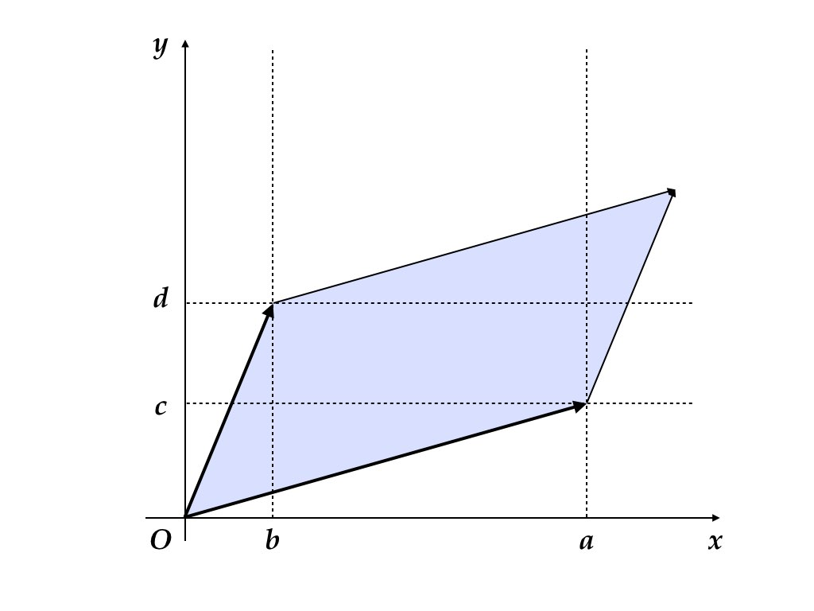

# 固有値 {#eigen}

本章では，行列の固有値に関して復習する。

## 行列式 

### 置換

有限個の自然数の集合 $\{1,2,\dots,n-1,n\}$ を並び替える方法には $n!$ 通りの方法がある。この並び替え全体の集合を
$S_n$ で表す。例えば $\sigma'=(1,2,\dots,n-1,n)$ や $\sigma''=(n,n-1,\dots,2,1)$
などが$S_{n}$ の元である。$S_{n}$ の元を**置換 (permutation)**と呼ぶ。置換 $\sigma\in S_{n}$ を $\{1,2,\dots,n\}$
からそれ自身への全単射と考えて，$\sigma'(1)=1$，$\sigma''(n-1)=2$ などのように書くこともできる.
この記法は置換の合成 (通常，「積」と呼ばれる) の自然な定義を導いてくれる。すなわち

$$
  (\sigma_{1}\sigma_{2})(i)=\sigma_{1}(\sigma_{2}(i)),\quad i=1,2,\dots,n.
$$

**恒等置換 (identity permutation)**とは，$\sigma_{id}(i)=i$，$i=1,\dots,n$ なる置換である。**互換 (transposition)**とは，2つの文字を入れ替える特別な置換である。すなわち $i\neq j$ に対して 
$$
  \pi_{ij}(i)=j,\quad\pi_{ij}(j)=i,\quad\pi_{ij}(k)=k,\quad k\neq i,j.
$$
すべての置換は互換の積として表すことができる。例えば，$\sigma=(2,3,4,1)$ とすれば
$$
  (1,2,3,4)\xrightarrow{\pi_{1,2}}(2,1,3,4)\xrightarrow{\pi_{1,3}}(2,3,1,4)\xrightarrow{\pi_{1,4}}(2,3,4,1)
$$
なので，$\sigma=\pi_{1,4}\pi_{1,3}\pi_{1,2}$ となる。この分解の方法は一意的ではないが，分解を構成する互換の数は奇遇が不変となることが知られている。奇数個の互換の積に分解できる置換を**奇置換 (odd permutation)**,
偶数個の互換の積に分解できる置換を**偶置換 (even permutation)** と呼ぶ。写像 $\mathrm{sgn}:S_{n}\to\{-1,1\}$ を次のように定義できる.
$$
  \mathrm{sgn}(\sigma)=\begin{cases}
  -1 & \mbox{if }\sigma\mbox{ is odd}\\
  +1 & \mbox{if }\sigma\mbox{ is even}.
  \end{cases}
$$

### 行列式の定義

正方行列 $A=[a_{ij}]\in\mathbb{F}^{n\times n}$ に対して，**行列式 (determinant)** $\det A$ ($|A|$とも書く) を次のように定義する。
$$
  \det A=\sum_{\sigma\in S_{n}}\mathrm{sgn}(\sigma)a_{1\sigma(1)}\cdots a_{n\sigma(n)}.
$$

```{proposition, determinant}
行列式は次の性質を持つ.

1. $\det A^{\top}=\det A$.
2. $\det C_{ij}A=-\det A$ (行の交換で符号が変わる).
3. $\det D_{i}^{n}(a)A=a\det A$ (行の$a$倍で行列式が$a$倍になる。$a=0$ でも成り立つ)。
4. $\det\left(E_{ij}^{n}(a)A\right)=\det A$ (行の$a$倍を別の行に加えても行列式は変化しない).
5. $$
      \det\left[\begin{array}{ccc}
      a_{11} & \cdots & a_{1n}\\
      a_{i1}+b_{i1} & \cdots & a_{in}+b_{in}\\
      a_{n1} & \cdots & a_{nn}
      \end{array}\right]=\det\left[\begin{array}{ccc}
      a_{11} & \cdots & a_{1n}\\
      a_{i1} & \cdots & a_{in}\\
      a_{n1} & \cdots & a_{nn}
      \end{array}\right]+\det\left[\begin{array}{ccc}
      a_{11} & \cdots & a_{1n}\\
      b_{i1} & \cdots & b_{in}\\
      a_{n1} & \cdots & a_{nn}
      \end{array}\right].
    $$
6. $\det I=1$.
7. $\det AB=\det A\det B$.

```

```{block2, type="exercise"}
命題 \@ref(prp:determinant) を証明せよ.
```

```{block2, type="fact"}
$A \in \mathbb{F}^{n \times n}$ が正則であるための必要十分条件は $\det A \neq 0$。 
```

```{proof}
$A$ が正則であるとしよう。このとき，命題 \@ref(prp:determinant) 性質6，7 より，
$1 = \det I = \det A \det A^{-1}$ が成り立つから $\det A = 0$ にはなりえない。
次に，$\det A \neq 0$ が成り立つとして，$A$ の正則性を導こう。対偶を示す[^contraposition]。
$A$が正則でければ $A$はフルランクでない（命題\@ref(prp:fullrank)）。
このとき正則行列 $P, Q$ が存在して，
$$
PAQ=\left[
  \begin{array}{c|c}
    I_{d\times d} & O_{d\times(n-d)}\\
    \hline O_{(m-d)\times d} & O_{(m-d)\times(n-d)}
  \end{array}\right]
$$
とできる。右辺の行列式は定義によりゼロである。
命題 \@ref(prp:determinant) 性質7 により，$\det P \det A \det Q = 0$。
正則行列 $P, Q$ に対しては $\det P \neq 0 \neq \det Q$ が成り立つことが分かっているから，
$\det A = 0$ が成り立たなければならない。
```

[^contraposition]: 命題$P$: $A \Longrightarrow B$ が真（true）のとき，またそのときに限り，
命題$P'$: $\neg B \Longrightarrow \neg A$ は真である。ただし，$\neg A$ は$A$ の否定。 命題$P'$を命題$P$の対偶命題という。主命題を証明するよりも対偶命題の証明が易しい
（思いつきやすい）場合には対偶命題を示せばよい。

### 行列式の意味

2次正方行列
$$
A = 
\begin{bmatrix}
  a & b \\
  c & d
\end{bmatrix}
$$
の行列式は定義に従って容易に計算することができる。
$$
  \det A = ad - bc
$$
この量は，行列$A$の列を成す2つのベクトル
$$
  A_1 = \begin{bmatrix} a \\ c \end{bmatrix},
  \quad
  A_2 = \begin{bmatrix} b \\ d \end{bmatrix}
$$
が作る平行四辺形 (parallelogram) の（符号付き）面積と一致する（図\@ref(fig:parallelogram)の色付き部分）。

```{r parallelogram, fig.cap="列ベクトルが成す平行四辺形", echo=FALSE}

```

一般の次数でも同様の考え方が

## 固有値

複素数 $\lambda$ が正方行列 $A\in\mathbb{F}^{n\times n}$ の**固有値 (eigenvalue)**
であるとは，ゼロでない列ベクトル $v\in\mathbb{C}^{n}$ が存在して 
$$
  Av=\lambda v
$$
が成り立つことをいう。 ベクトル $v$ を固有値 $\lambda$ に対応する固有ベクトル (eigenvector) という.
上の方程式を変形すると線形方程式
$$
  (\lambda I-A)v=0
$$
が得られる。この方程式がゼロでないベクトルを解に持つための必要十分条件は
$$
  \phi_{A}(\lambda)=\det(\lambda I-A)=0
$$
が成り立つことである。

```{block2, type="exercise"}
上の事実を確認せよ。
```

$\phi_{A}(\lambda)$ は $\lambda$ に関する $n$ 次多項式であり,
固有多項式 (characteristic polynomial) という。$\phi_{A}(\lambda)=0$ は重複度を込めて$n$ 個の解を持つので，$A$ は (重複度を込めて) $n$ 個の固有値を持つ[^代数学の基本定理。]。
$$
  \phi_{A}(\lambda)=\lambda^{n}+c_{1}\lambda^{n-1}+\cdots+c_{n}
$$
とおけば，
$$
  c_{1}=-\mathrm{trace}A,\qquad c_{n}=(-1)^{n}\det A
$$
である.

```{block2, type="exercise"}
上の事実を確認せよ。
```

```{theorem}
実行列 $A\in\mathbb{R}^{n\times n}$が複素固有値 $\lambda$ を持てば，$\bar{\lambda}$ も$A$ の固有値である.
```

```{block2, type="exercise"} 
上の定理を証明せよ.
```

```{theorem, independence2}
異なる固有値 $\lambda_{1}\neq\lambda_{2}$ に対する固有ベクトル $v_{1}$，$v_{2}$ は次の性質を持つ: $\alpha_{1},\alpha_{2}\in\mathbb{C}$ に対して
$$
  \alpha_{1}v_{1}+\alpha_{2}v_{2}=0\Rightarrow\alpha_{1}=\alpha_{2}=0. 
$$ 
```
すなわち，異なる固有値に対応する固有ベクトルは**1次独立（linearly independent）**である。
```{proof}
  1次独立性が成り立たないとする。すなわち，$\alpha_{1}\neq0\neq\alpha_{2}$ があって $\alpha_{1}v_{1}+\alpha_{2}v_{2}=0$を満すとする。このとき，
  $$
    \alpha_{1}Av_{1}+\alpha_{2}Av_{2}=0.
  $$
  固有値の定義より
  $$
    \alpha_{1}\lambda_{1}v_{1}+\alpha_{2}\lambda_{2}v_{2}=0.
  $$
  $\lambda_{1}\neq\lambda_{2}$ より，一方はゼロでない。一般性を失うことなく$\lambda_{1}\neq0$ とできて,
  $$
    \alpha_{1}v_{1}+(\lambda_{2}/\lambda_{1})\alpha_{2}v_{2}=0.
  $$
  $\alpha_1 v_1 + \alpha_2 v_2 = 0$ より,
  $$
    \left[
      1 - (\lambda_{2}/\lambda_{1})
    \right] \alpha_{1}v_{1}=0.
  $$
  
  $\alpha_{1}\neq0$，$v_{1}\neq0$ なので，$\lambda_{2}/\lambda_{1}=1$
  が成り立たなければならないが,　これは異なる固有値を選んだという前提に矛盾する。従って，相異なる固有値に対応する固有ベクトルは1次独立でなければならない。
```

2つ以上の異なる固有値についても同様のことが証明できる。

```{theorem, independenceN}
正方行列 $A \in \mathbb R^{n \times n}$ が相異なる固有値 $\lambda_{1}, \dots, \lambda_{n}$
をもつとする。それぞれの固有値 $\lambda_i$ に対応する固有ベクトル $v_i$ としたとき，
$\{ v_1, \dots, v_n \}$ は1次独立である。 すなわち，
$\alpha_{1},\dots,\alpha_{n}\in\mathbb{C}$ に対して $\alpha_{1}v_{1}+ \cdots + \alpha_{n}v_{n}=0$ 
が成り立てば，$\alpha_{1}=\cdots=\alpha_{n}=0$ が成り立つ。
```

```{block2, type="exercise"}
定理\@ref(thm:independenceN)を証明せよ。
```

## 対角化

### 例題: 対角化

行列 
\[
J=\left[\begin{array}{cc}
0 & -1\\
1 & 0
\end{array}\right]
\]
の固有値と固有ベクトルを計算してみよう。
\[
\det(\lambda J-I)=\left|\left[\begin{array}{cc}
\lambda & 1\\
-1 & \lambda
\end{array}\right]\right|=\lambda^{2}+1
\]
だから，固有値は $\pm j$ である。固有値 $j$ に対する固有ベクトルは，
\[
\left[\begin{array}{cc}
0 & -1\\
1 & 0
\end{array}\right]\left[\begin{array}{c}
x\\
y
\end{array}\right]=j\left[\begin{array}{c}
x\\
y
\end{array}\right]
\]
の解であり，
\[
x=jy
\]
によって特徴付けられる。例えば，
\[
v_{j}=\left[\begin{array}{c}
j\\
1
\end{array}\right]
\]
が固有ベクトルである。固有値 $-j$ に対する固有ベクトルは，
\[
\left[\begin{array}{cc}
0 & -1\\
1 & 0
\end{array}\right]\left[\begin{array}{c}
x\\
y
\end{array}\right]=-j\left[\begin{array}{c}
x\\
y
\end{array}\right]
\]
の解であり，
\[
jx=y
\]
によって特徴付けられる。例えば，
\[
v_{-j}=\left[\begin{array}{c}
1\\
j
\end{array}\right]
\]
が固有ベクトルである。

固有ベクトル$v_{j}$ と $v_{-j}$を並べた行列
\[
V=[\begin{array}{cc}
v_{j} & v_{-j}\end{array}]=\left[\begin{array}{cc}
j & 1\\
1 & j
\end{array}\right]
\]
は正則であり，
\[
V^{-1}=\frac{1}{j^{2}-1}\left[\begin{array}{cc}
j & -1\\
-1 & j
\end{array}\right]=\left[\begin{array}{cc}
-j/2 & 1/2\\
1/2 & -j/2
\end{array}\right].
\]
\begin{align*}
V\left[\begin{array}{cc}
j & 0\\
0 & -j
\end{array}\right]V^{-1} & =\left[\begin{array}{cc}
j & 1\\
1 & j
\end{array}\right]\left[\begin{array}{cc}
j & 0\\
0 & -j
\end{array}\right]\left[\begin{array}{cc}
-j/2 & 1/2\\
1/2 & -j/2
\end{array}\right]\\
 & =\left[\begin{array}{cc}
-1 & -j\\
j & 1
\end{array}\right]\left[\begin{array}{cc}
-j/2 & 1/2\\
1/2 & -j/2
\end{array}\right]\\
 & =\left[\begin{array}{cc}
0 & -1\\
1 & 0
\end{array}\right]\\
 & =J.
\end{align*}
あるいは
\[
\left[\begin{array}{cc}
j & 0\\
0 & -j
\end{array}\right]=V^{-1}JV
\]
が成り立つ。固有値を並べた行列によって $J$ を対角行列に変形 (対角化) することができる。あらゆる行列に対してこのような変形ができる訳ではないことには注意が必要である.
すべての固有値が相異なる場合や，対称行列などが対角化が可能である。

\section{補論}

行列
\[
J=\left[\begin{array}{cc}
0 & -1\\
1 & 0
\end{array}\right]
\]
に対して 
\[
J^{2}=-I
\]
が成り立つ，$J$ は虚数単位の行列表現である。複素数 $z=a+bj$ を行列を用いて表現すると 
\[
Z=aI+bJ=\left[\begin{array}{cc}
a & -b\\
b & a
\end{array}\right].
\]
$r=\sqrt{a^{2}+b^{2}}$，$\theta=\arctan(b/a)$ とすれば ($a=0$，$b>0$
のとき$\theta=\pi/2$，$a=0$，$b<0$ のとき$\theta=-\pi/2$ とする)，
\[
Z=r\left[\begin{array}{cc}
\cos\theta & -\sin\theta\\
\sin\theta & \cos\theta
\end{array}\right]
\]
と書ける。
\begin{align*}
Z\left[\begin{array}{c}
x_{1}\\
x_{2}
\end{array}\right] & =r\left[\begin{array}{cc}
\cos\theta & -\sin\theta\\
\sin\theta & \cos\theta
\end{array}\right]\left[\begin{array}{c}
x_{1}\\
x_{2}
\end{array}\right]
\end{align*}
がベクトルの伸縮と回転という複素数積と同様の性質を持っていることを確認しておいてほしい。この考え方は実係数の範囲で行列を標準化 (ブロック対角化,
実ジョルダン標準化)する場合などに役に立つ.\footnote{この講義では複素数の範囲で標準化を考える.} 固有値に複素数 $a\pm bj$
が含まれる場合，対角ブロックに $aI+bJ$ を含むブロック対角行列が得られるのである。


