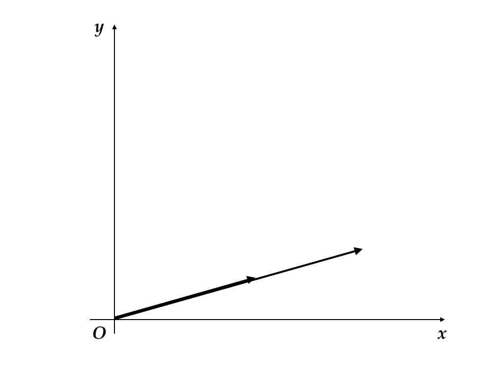
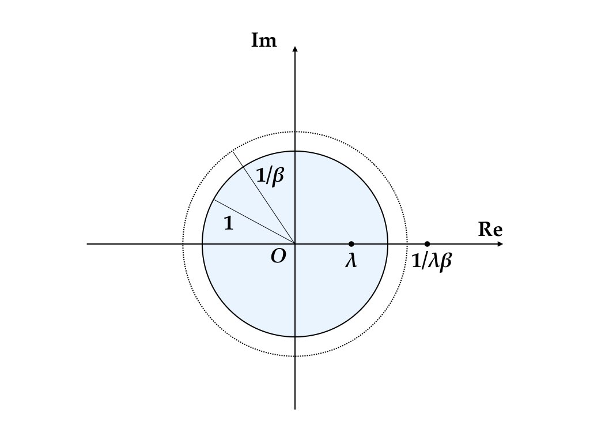
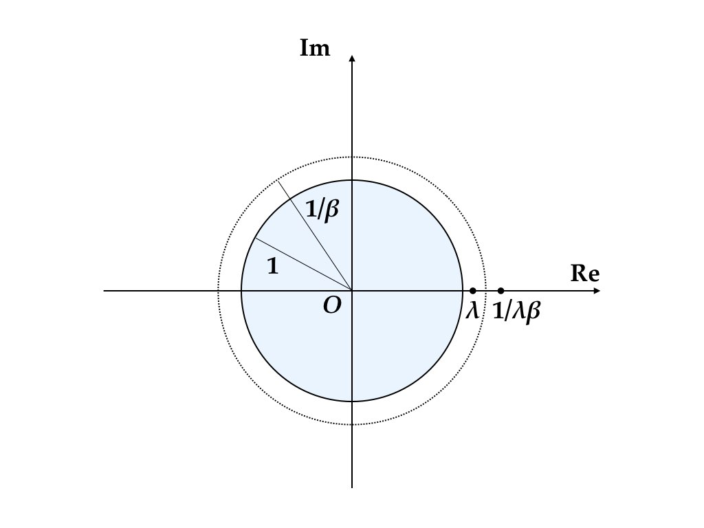
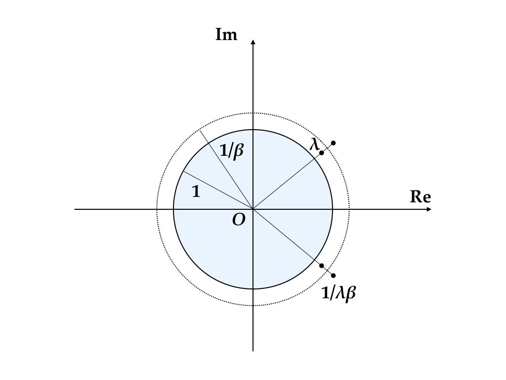

# 固有値 {#eigen}

本章では，行列の固有値に関して復習する。

## 行列式 

### 置換

有限個の自然数の集合 $\{1,2,\dots,n-1,n\}$ を並び替える方法には $n!$ 通りの方法がある。この並び替え全体の集合を
$S_n$ で表す。例えば $\sigma'=(1,2,\dots,n-1,n)$ や $\sigma''=(n,n-1,\dots,2,1)$
などが$S_{n}$ の元である。$S_{n}$ の元を**置換 (permutation)**と呼ぶ。置換 $\sigma\in S_{n}$ を $\{1,2,\dots,n\}$
からそれ自身への全単射と考えて，$\sigma'(1)=1$，$\sigma''(n-1)=2$ などのように書くこともできる.
この記法は置換の合成 (通常，「積」と呼ばれる) の自然な定義を導いてくれる。すなわち

$$
  (\sigma_{1}\sigma_{2})(i)=\sigma_{1}(\sigma_{2}(i)),\quad i=1,2,\dots,n.
$$

**恒等置換 (identity permutation)**とは，$\sigma_{id}(i)=i$，$i=1,\dots,n$ なる置換である。**互換 (transposition)**とは，2つの文字を入れ替える特別な置換である。すなわち $i\neq j$ に対して 
$$
  \pi_{ij}(i)=j,\quad\pi_{ij}(j)=i,\quad\pi_{ij}(k)=k,\quad k\neq i,j.
$$
すべての置換は互換の積として表すことができる。例えば，$\sigma=(2,3,4,1)$ とすれば
$$
  (1,2,3,4)\xrightarrow{\pi_{1,2}}(2,1,3,4)\xrightarrow{\pi_{1,3}}(2,3,1,4)\xrightarrow{\pi_{1,4}}(2,3,4,1)
$$
なので，$\sigma=\pi_{1,4}\pi_{1,3}\pi_{1,2}$ となる。この分解の方法は一意的ではないが，分解を構成する互換の数は奇遇が不変となることが知られている。奇数個の互換の積に分解できる置換を**奇置換 (odd permutation)**,
偶数個の互換の積に分解できる置換を**偶置換 (even permutation)** と呼ぶ。写像 $\mathrm{sgn}:S_{n}\to\{-1,1\}$ を次のように定義できる.
$$
  \mathrm{sgn}(\sigma)=\begin{cases}
  -1 & \mbox{if }\sigma\mbox{ is odd}\\
  +1 & \mbox{if }\sigma\mbox{ is even}.
  \end{cases}
$$

### 行列式の定義

正方行列 $A=[a_{ij}]\in\mathbb{F}^{n\times n}$ に対して，**行列式 (determinant)** $\det A$ ($|A|$とも書く) を次のように定義する。
$$
  \det A=\sum_{\sigma\in S_{n}}\mathrm{sgn}(\sigma)a_{1\sigma(1)}\cdots a_{n\sigma(n)}.
$$

```{proposition, determinant}
行列式は次の性質を持つ.

1. $\det A^{\top}=\det A$.
2. $\det C_{ij}A=-\det A$ (行の交換で符号が変わる).
3. $\det D_{i}^{n}(a)A=a\det A$ (行の$a$倍で行列式が$a$倍になる。$a=0$ でも成り立つ)。
4. $\det\left(E_{ij}^{n}(a)A\right)=\det A$ (行の$a$倍を別の行に加えても行列式は変化しない).
5. $$
      \det\begin{bmatrix}
      a_{11} & \cdots & a_{1n}\\
      a_{i1}+b_{i1} & \cdots & a_{in}+b_{in}\\
      a_{n1} & \cdots & a_{nn}
      \end{bmatrix}=\det\begin{bmatrix}
      a_{11} & \cdots & a_{1n}\\
      a_{i1} & \cdots & a_{in}\\
      a_{n1} & \cdots & a_{nn}
      \end{bmatrix}+\det\begin{bmatrix}
      a_{11} & \cdots & a_{1n}\\
      b_{i1} & \cdots & b_{in}\\
      a_{n1} & \cdots & a_{nn}
      \end{bmatrix}.
    $$
6. $\det I=1$.
7. $\det AB=\det A\det B$.

```

```{block2, type="exercise"}
命題 \@ref(prp:determinant) を証明せよ.
```

```{block2, type="fact"}
$A \in \mathbb{F}^{n \times n}$ が正則であるための必要十分条件は $\det A \neq 0$。 
```

```{proof}
$A$ が正則であるとしよう。このとき，命題 \@ref(prp:determinant) 性質6，7 より，
$1 = \det I = \det A \det A^{-1}$ が成り立つから $\det A = 0$ にはなりえない。
次に，$\det A \neq 0$ が成り立つとして，$A$ の正則性を導こう。対偶を示す[^contraposition]。
$A$が正則でければ $A$はフルランクでない（命題\@ref(prp:fullrank)）。
このとき正則行列 $P, Q$ が存在して，
$$
PAQ=\left[
  \begin{array}{c|c}
    I_{d\times d} & O_{d\times(n-d)}\\
    \hline O_{(m-d)\times d} & O_{(m-d)\times(n-d)}
  \end{array}
\right]
$$
とできる。右辺の行列式は定義によりゼロである。
命題 \@ref(prp:determinant) 性質7 により，$\det P \det A \det Q = 0$。
正則行列 $P, Q$ に対しては $\det P \neq 0 \neq \det Q$ が成り立つことが分かっているから，
$\det A = 0$ が成り立たなければならない。
```

[^contraposition]: 命題$P$: $A \Longrightarrow B$ が真（true）のとき，またそのときに限り，
命題$P'$: $\neg B \Longrightarrow \neg A$ は真である。ただし，$\neg A$ は$A$ の否定。 命題$P'$を命題$P$の対偶命題という。主命題を証明するよりも対偶命題の証明が易しい
（思いつきやすい）場合には対偶命題を示せばよい。

### 行列式の意味

2次正方行列
$$
A = 
\begin{bmatrix}
  a & b \\
  c & d
\end{bmatrix}
$$
の行列式は定義に従って容易に計算することができる。
$$
  \det A = ad - bc
$$
この量は，行列$A$の列を成す2つのベクトル
$$
  A_1 = \begin{bmatrix} a \\ c \end{bmatrix},
  \quad
  A_2 = \begin{bmatrix} b \\ d \end{bmatrix}
$$
が作る平行四辺形 (parallelogram) の（符号付き）面積と一致する（図\@ref(fig:parallelogram)の色付き部分）。

```{r parallelogram, fig.cap="列ベクトルが成す平行四辺形", echo=FALSE}
knitr::include_graphics("figures/04-eigen/04-eigen.001.jpeg")
```

一般の次数でも同様の考え方が適用できる。例えば，3次正方行列の行列式は，列ベクトルが作る平行6面体（parallelepiped）の符号付き体積と一致する（図\@ref(fig:parallelepiped)）。

```{r parallelepiped, fig.cap="列ベクトルが成す平行六面体", echo=FALSE}
knitr::include_graphics("figures/04-eigen/04-eigen.002.jpeg")
```

このことから分かることは，行列を構成する列に同じ向きを持つ（平行な）ベクトルが含まれていると行列式は必ずゼロになるということである。

```{r parallel-columns, fig.cap="平行な列ベクトル", echo=FALSE}

```

2本のベクトル$v_1 \neq 0 \neq v_2$ が面積を持つ平行四辺形を作るための必要十分条件は，
$v_1 = \alpha v_2$ となるような, $\alpha \neq 0$ が存在しないことである（図\@ref(fig:parallel-columns)）。
ゼロと異なる3本のベクトル $v_1, v_2, v_3$ が体積を持つ平行六面体を作るための必要十分条件は，
$v_1 = \alpha v_2 + \beta v_3$ かつ $\alpha$ と $\beta$ は同時にはゼロでないというものである。
いずれかのベクトルがゼロである可能性も考慮して，次のような概念を定義すると便利である。

```{definition}
$n$ 本のベクトル $v_1, \dots, v_n$ が**1次独立（linearly independent）**であるとは,
$\alpha_{1},\dots,\alpha_{n}$ に対して $\alpha_{1}v_{1}+ \cdots + \alpha_{n}v_{n}=0$ 
が成り立てば，$\alpha_{1}=\cdots=\alpha_{n}=0$ が成り立つことをいう。
1次独立でないとき，ベクトルの組は **1次従属（linearly dependent）**であるという。
```

行列を構成する列ベクトルが1次独立でなければ，列基本変形によりゼロのみからなる列を構成することができる。したがって，そのような行列の行列式はゼロでなければならない。逆に，行列が1次独立な列をもつならば（後に示すように），その行列はフルランクである。したがって，行列式はゼロでない。


これから先，正方行列の正則性は列ベクトルの1次独立性，行列式がゼロでないこと，行列のランクが次数と一致することなど同値な条件が形を変えて繰り返し現れることになる。これらの関係を理解しておくと動学理論を見通しよく習得できる。

## 固有値と固有ベクトル

複素数 $\lambda$ が正方行列 $A\in\mathbb{F}^{n\times n}$ の**固有値 (eigenvalue)**
であるとは，ゼロでない列ベクトル $v\in\mathbb{C}^{n}$ が存在して 
$$
  Av=\lambda v
$$
が成り立つことをいう。ベクトル $v$ を固有値 $\lambda$ に対応する**固有ベクトル (eigenvector) **という。
一般に，行列を掛けるとベクトルの向きを回転させるのだが，固有ベクトルに対してだけは向きを変えないか，
あるいは $\lambda$ が負であればベクトルの矢印を反転させる。

固有ベクトルという言葉は，1つの固有値に対して1つの固有ベクトルがあるというような印象を与えるかもしれない。
しかし，$v$ が固有ベクトルであれば，$2v$ も $-3v$ も固有ベクトルであることが容易に確かめられる。
あるいは，1つの固有値に対して，1次独立な $v, w$ という2つの固有ベクトルが見つかることもある。
このとき $v + w$ も $-v + 3w$ も同じ固有値に対する固有ベクトルである。
固有ベクトルを特定の性質を持つベクトルの集合（固有空間 eigenspace）から任意に1つ選んだものと認識しておくとよい。


方程式$Av=\lambda v$の自明な変形により
$$
  (\lambda I-A)v=0
$$
が得られる。この方程式がゼロでないベクトルを解に持つための必要十分条件は
$$
  \phi_{A}(\lambda)=\det(\lambda I-A)=0
$$
が成り立つことである。

```{block2, type="exercise"}
上の事実を確認せよ。[ヒント：正則性と行列式の関係を使う。]
```


$\phi_{A}(\lambda)$ は $\lambda$ に関する $n$ 次多項式であり,
**固有多項式 (characteristic polynomial)** という。$\phi_{A}(\lambda)=0$ は重複度を込めて$n$ 個の解を持つので，$A$ は (重複度を込めて) $n$ 個の固有値を持つ^[代数学の基本定理（定理\@ref(thm:fundamental-theorem-algebra)）。]。

```{block2, type="exercise"}
固有多項式の係数を
$$
  \phi_{A}(\lambda)=\lambda^{n}+c_{1}\lambda^{n-1}+\cdots+c_{n}
$$
とすれば，
$$
  c_{1}=-\operatorname{trace} A,\qquad c_{n}=(-1)^{n}\det A
$$
が成り立つことを示せ。 なお，$\operatorname{trace} A = \sum_{i=1}^n A_{i,i}$ は行列 $A$ のトレースといい，
対角成分を足して得られる数である。
```

```{theorem, conju-eigen-pair}
実行列 $A\in\mathbb{R}^{n\times n}$が複素固有値 $\lambda$ を持てば，$\bar{\lambda}$ も$A$ の固有値である。
```

```{block2, type="exercise"} 
定理\@ref(thm:conju-eigen-pair)を証明せよ。
```

```{theorem, independence2}
異なる固有値 $\lambda_{1}\neq\lambda_{2}$ に対する固有ベクトル $v_{1}$，$v_{2}$ は1次独立である。すなわち $\alpha_{1},\alpha_{2}\in\mathbb{C}$ に対して，
$$
  \alpha_{1}v_{1}+\alpha_{2}v_{2}=0\Rightarrow\alpha_{1}=\alpha_{2}=0. 
$$ 
```


```{proof}
定理の主張に反して1次従属であったとしよう。すなわち，同時にはゼロでない
$\alpha_{1}, \alpha_{2}$ があって$\alpha_{1}v_{1}+\alpha_{2}v_{2}=0$を満たすとする。
一般性を失うことなく，$\alpha_1 \neq 0$ とできる。
このとき，
$$
  \alpha_{1}Av_{1}+\alpha_{2}Av_{2}=0.
$$
固有値の定義より
$$
  \alpha_{1}\lambda_{1}v_{1}+\alpha_{2}\lambda_{2}v_{2}=0.
$$
$\lambda_{1}\neq\lambda_{2}$ より，一方はゼロでない。一般性を失うことなく$\lambda_{1}\neq0$ とできて,
$$
  \alpha_{1}v_{1}+(\lambda_{2}/\lambda_{1})\alpha_{2}v_{2}=0.
$$
$\alpha_1 v_1 + \alpha_2 v_2 = 0$ より,
$$
  \left[
    1 - (\lambda_{2}/\lambda_{1})
  \right] \alpha_{1}v_{1}=0.
$$
$\alpha_{1}\neq0$，$v_{1}\neq0$ なので，$\lambda_{2}/\lambda_{1}=1$
が成り立たなければならないが,　これは異なる固有値を選んだという前提に矛盾する
従って，相異なる固有値に対応する固有ベクトルは1次独立でなければならない。
```


2つ以上の異なる固有値についても同様のことが証明できる。

```{theorem, independenceN}
正方行列 $A \in \mathbb R^{n \times n}$ が相異なる固有値 $\lambda_{1}, \dots, \lambda_{n}$
をもつとする。それぞれの固有値 $\lambda_i$ に対応する固有ベクトル $v_i$ としたとき，
$\{ v_1, \dots, v_n \}$ は1次独立である。 すなわち，
$\alpha_{1},\dots,\alpha_{n}\in\mathbb{C}$ に対して $\alpha_{1}v_{1}+ \cdots + \alpha_{n}v_{n}=0$ 
が成り立てば，$\alpha_{1}=\cdots=\alpha_{n}=0$ が成り立つ。
```

```{block2, type="exercise"}
定理\@ref(thm:independenceN)を証明せよ。
```

## 対角化

### 計算方法の確認

対角化（diagonalization）というのは，行列の標準形（canonical form）の中でももっとも基本的なものであるから，
きちんと理解して使えるようになってほしい。
理論的な解説は次章以降に譲って，ここでは計算方法を思い出してもらおう。

簡単のため，行列 $A \in \mathbb R^{n \times n}$ の固有値$\lambda_1,\dots, \lambda_n \in \mathbb C$
が互いに異なると仮定する。対応する固有ベクトルをそれぞれ $v_1,\dots, v_n \in \mathbb C^n$ とすれば，
$$
Av_1 = \lambda_1 v_1, \dots, Av_n = \lambda_n v_n
$$
が成り立つ。$v_1, \dots, v_n$ を並べた行列
$$
V = \begin{bmatrix} v_1 & \cdots & v_n \end{bmatrix}
$$
を定義すれば，
$$
\begin{aligned}
AV &= \begin{bmatrix} Av_1 & \cdots & Av_n \end{bmatrix} \\
   &= \begin{bmatrix} \lambda_1 v_1 & \cdots & \lambda_n v_n \end{bmatrix}\\
   &= \begin{bmatrix} v_1 & \cdots & v_n \end{bmatrix}
   \begin{bmatrix} 
     \lambda_1 &        & \\
               & \ddots & \\
               &        & \lambda_n
   \end{bmatrix} \\
   &= VD
\end{aligned}
$$
が成り立つ。ただし，
$$
D = 
\begin{bmatrix} 
\lambda_1 &        & \\
          & \ddots & \\
          &        & \lambda_n
\end{bmatrix} 
$$
とおいた。

もとの行列と対角化行列を行き来するために，固有ベクトルを並べた行列$V$ が重要な役割を果たす。
実際，定理\@ref(thm:independenceN) によって$V$が正則であることが分かる。$V^{-1}$が存在するので，
$$
A = VDV^{-1}, \qquad D = V^{-1}AV
$$
という公式を得る。

### 例題

行列 
$$
J =
\begin{bmatrix}
  0 & -1\\
  1 & 0
\end{bmatrix}
$$
の固有値と固有ベクトルを計算してみよう。
$$
\det(\lambda J-I) 
  = 
  \left|
    \begin{bmatrix}
      \lambda & 1\\
      -1      & \lambda
    \end{bmatrix}
  \right|
  =
  \lambda^2 + 1
$$
だから，固有値は $\pm i$ である。固有値 $i$ に対する固有ベクトルは，
$$
\begin{bmatrix}
  0 & -1\\
  1 & 0
\end{bmatrix}
\begin{bmatrix}
  x\\
  y
\end{bmatrix}
=
i \begin{bmatrix}
  x\\
  y
\end{bmatrix}
$$
の解であり，
$$
  x = iy
$$
によって特徴付けられる。例えば，
$$
v_i = \begin{bmatrix}i\\1\end{bmatrix}
$$
が固有ベクトルである。固有値 $- i$ に対する固有ベクトルは，
$$
\begin{bmatrix}
  0 & -1\\
  1 & 0
\end{bmatrix}
\begin{bmatrix} x\\ y \end{bmatrix}
=
- i \begin{bmatrix} x\\y \end{bmatrix}
$$
の解であり，
$$
ix=y
$$
によって特徴付けられる。例えば，
$$
v_{-i}=\begin{bmatrix} 1\\ i \end{bmatrix}
$$
が固有ベクトルである。

固有ベクトル$v_{i}$ と $v_{-i}$を並べた行列
$$
V = \begin{bmatrix} v_{j} & v_{-j} \end{bmatrix} 
= 
\begin{bmatrix}
  i & 1\\
  1 & i
\end{bmatrix}
$$
は正則であり（$\det V = i^2 - 1 = -2$），
$$
V^{-1}
=
\frac{1}{i^2-1}
\begin{bmatrix}
  i & -1\\
  -1 & i
\end{bmatrix}
=
\begin{bmatrix}
  -i/2 & 1/2\\
  1/2 & -i/2
\end{bmatrix}.
$$
$$
\begin{aligned}
  V\begin{bmatrix}
    i & 0\\
    0 & -i
  \end{bmatrix}V^{-1} 
  & =
  \begin{bmatrix}
    i & 1\\
    1 & i
  \end{bmatrix}\begin{bmatrix}
    i & 0\\
    0 & -i
  \end{bmatrix}\begin{bmatrix}
    -i/2 & 1/2\\
    1/2 & -i/2
  \end{bmatrix}\\
  & =
  \begin{bmatrix}
    -1 & -i\\
     i & 1
  \end{bmatrix}\begin{bmatrix}
    -i/2 & 1/2\\
    1/2 & -i/2
  \end{bmatrix}\\
  & =
  \begin{bmatrix}
    0 & -1\\
    1 & 0
  \end{bmatrix}\\
   & = J.
\end{aligned}
$$
あるいは
\begin{equation}
\begin{bmatrix}
i & 0\\
0 & -i
\end{bmatrix}
=
V^{-1}JV
(\#eq:Jmatrix)
\end{equation}
が成り立つ。固有ベクトルを並べた行列$V$によって $J$ を対角行列に変形 (対角化) することができた。
あらゆる行列に対してこのような変形ができる訳ではないことには注意が必要である。
すべての固有値が相異なる場合や，対称行列などが対角化が可能である。


### 複素数の行列表現

行列
$$
J = \begin{bmatrix}
  0 & -1\\
  1 & 0
\end{bmatrix}
$$
に対して 
$$
J^{2}=-I
$$
が成り立つことに注意しよう。$I$ を実数の単位（すなわち，$1$）と対応させれば，
$J$ が虚数単位と同じ性質を持つことが想像できるだろう。複素数 $z = a + bi$ 
を行列を用いて 
$$
Z 
= 
aI+bJ
=
\begin{bmatrix}
  a & -b\\
  b & a
\end{bmatrix}
$$
と表すことができる。これをさらに極形式 $z = re^{i \theta} = r\cos \theta + i(r \sin \theta)$，
$r \ge 0, 0 \le \theta < 2\pi$ の記号を用いて書き直せば，
$$
Z=r\begin{bmatrix}
\cos\theta & -\sin\theta\\
\sin\theta & \cos\theta
\end{bmatrix}
$$
とできる。
$$
  Z^n
  \begin{bmatrix}
    x_{1}\\
    x_{2}
  \end{bmatrix} 
  =
  r^n
  \begin{bmatrix}
    \cos n\theta & -\sin n\theta\\
    \sin n\theta & \cos n\theta
  \end{bmatrix}
  \begin{bmatrix}
    x_{1}\\
    x_{2}
  \end{bmatrix}
$$
をR上で計算し，$Z$ がベクトルの伸縮と回転という複素数積と同様の性質を持っていることを確認しておこう。


```{r}
r = 0.8; theta = pi / 6 # polar form
Z = r * matrix(c(cos(theta), -sin(theta), 
                 sin(theta),  cos(theta)), nrow=2, byrow=TRUE)
v0 = c(1, 0) # initial vector

# iterative multiplication 
simulation_size = 50 # >= 2
res = tibble(x1 = numeric(simulation_size),
             x2 = numeric(simulation_size))

res$x1[1] = v0[1]; res$x2[1] = v0[2]
for (i in 2:simulation_size) {
  v1 = Z %*% v0
  res$x1[i] = v1[1]; res$x2[i] = v1[2]
  v0 = v1
}

# plot
ggplot(res, aes(x1, x2)) + geom_point()
```


### 実対角化

複素数を実係数の行列で表現できるという考え方は，実係数の範囲で行列を標準化（ブロック対角化,
実ジョルダン標準化）する場合などに役に立つ。一般に固有値・固有ベクトルは複素数・複素ベクトルであるが，考えたいモデルの自然な表現が実数である場合には，実標準形の方が望ましいというケースもあるだろう。また，@Klein2000 が議論しているように，実標準形を用いる方が数値計算を高速に実行できるケースもある。

本書では複素数の範囲で標準化を考えるが，基本的な方針だけを述べておこう。

例えば，2次正方行列$A \in \mathbb R^2$ が対角化の手続きによって，
$$
  AP = P \begin{bmatrix} a + bi & 0 \\ 0 & a - bi \end{bmatrix}
$$
と対角化できたとしよう。
定理\@ref(thm:conju-eigen-pair)より共役複素数が必ずペアで現れることに注意せよ。
$P$ は固有ベクトルを並べた行列である。式\@ref(eq:Jmatrix)より，
$$
\begin{aligned}
  AP 
  &= P \left(
    a I + b \begin{bmatrix} i & 0 \\ 0 & - i \end{bmatrix}
  \right) \\
  &=
  P(aV^{-1}IV + b V^{-1} J V)\\
  &=
  PV^{-1} (aI + bJ) V
\end{aligned}
$$
したがって，
$$
A(PV^{-1}) = (PV^{-1})(aI + bJ)
$$
あるいは，
$$
A = (PV^{-1})(aI + bJ)(PV^{-1})^{-1}
$$
とできる。これが$A$の実行列の範囲での標準化（real canonical form）の基本である。
2次より大きい行列の場合には，
現れる複素数の数だけ $aI + bJ$ の形式のブロックが対角成分に並ぶ。
実対角化の結果は，例えば次のようなブロック対角行列になる。
$$
\begin{bmatrix}
  a_1 & -b_1 &     &      &       &        \\
  b_1 &  a_1 &     &      &       &        \\
      &      & a_2 & -b_2 &       &        \\
      &      & b_2 &  a_2 &       &        \\
      &      &     &      &\ddots &        \\
      &      &     &      &       & \ddots
 \end{bmatrix}
$$

## 線形動学方程式と固有値

再び，線形動学方程式
$$
x_{t+1} = Ax_t
$$
を考えよう。行列 $A$ が $AV = VD$ によって対角化されたとすると，
$y_t = 
$$
x_{t+1} = AVV^{-1}x_t = VDV^{-1} x_t.
$$
$y = V^{-1}x$ と定義すれば，
$$
y_{t+1} = Dy_t
$$
とできる。$y_t = D^t y_0$ は容易に計算することができる。実際，
$$
D = 
\begin{bmatrix} 
  \lambda_1 &        & \\
            & \ddots & \\
            &        & \lambda_n
\end{bmatrix}
$$
とすれば，
$$
D^t =
\begin{bmatrix} 
  \lambda_1^t &        & \\
              & \ddots & \\
              &        & \lambda_n^t
\end{bmatrix}, \qquad t = 0,1,\dots
$$
が成り立つ。$A^t = (VDV^{-1})^t= VD^tV^{-1}$ により, 固有値を用いて$x_t$ の振る舞いを分析できる。

固有値がすべて複素平面上の単位円の内側にあれば，原点は大域的に漸近安定である。
線形システムは安定であり，任意の初期値 $x_0$ に対して 
$\lim_{t\to\infty} x_t \to 0$ が成り立つ。すべての固有値が単位円の外側にあれば，
任意の初期値$x_0 \neq 0$ に対して，$x_t$ は発散する。すなわち，$\| x_t \| \to \infty$ が成り立つ^[$\|x\| = \sqrt{\sum_i x_i^2}$ （ユークリッドノルム，Euclidean norm）。あるいは任意のノルム。]。
このような挙動を指してシステムが**反安定 antistable**であると呼ぼう。

絶対値が1より小さい固有値を**安定固有値（stable eigenvalue）**,
1より大きい固有値を**不安定固有値（unstable eigenvalue）**と呼ぶ。
（ただし，この呼び方は離散時間システムを考えている限りにおいてのみ意味がある。
連続時間システムでは別の条件によって安定性が特徴付けられる。）

経済学においては，固有値のいくつかが安定であり，
残りが不安定であるというのが典型的である。このような原点を**鞍点（saddle）**，
システムの鞍点周りの挙動を鞍点安定（saddle-point stability）と呼んでいる。
力学系の理論では，通常，不安定性の一種として扱われることが多いのだが，
経済学ではすべての初期条件が与えられていない問題を考えるという事情によって
鞍点安定なシステムにおける収束経路に重要な解釈を与えている。
すなわち，発散する経路ではなく原点に収束していく経路が経済主体の意思決定によって選ばれるのである。これを仮定することもあれば，モデルの解が満たす条件として得られるケースもある。

実際には反安定となるケースもあるにはあるのだが，鞍点の方が発生しやすい。
ラムゼーモデルを通して観察してみよう。

## ラムゼーモデルと固有値

再びラムゼーモデルの不動点を考えよう。@LevhariLiviatan1972 によれば，$\lambda$ が固有値であれば，$1/(\beta \lambda)$ も固有値である。したがって，
ラムゼーモデルの不動点の固有値は複素平面上で原点を中心とする半径$1/\beta$
の円を挟むように分布する。

1セクターモデルではいずれも実数になるから，図\@ref(fig:ramsey-onesector-saddle) あるいは，
図\@ref(fig:ramsey-onesector-unstable) といったケースが典型的である。

```{r ramsey-onesector-saddle, fig.cap="鞍点（1セクター）", echo=FALSE}

```

```{r ramsey-onesector-unstable, fig.cap="不安定（1セクター）", echo=FALSE}

```


一般のセクターに対しては定理\@ref(thm:levhari-liviatan-santos-onesec) は成り立たない。
複素固有値 $\lambda$ が存在すれば，定理\@ref(thm:conju-eigen-pair) によって$\bar \lambda$ も固有値である。さらに，@LevhariLiviatan1972 によれば $1/(\beta \lambda)$ と 
$1/(\beta \bar \lambda)$も固有値である。1つの複素固有値から3つの複素固有値が派生する。図\@ref(fig:ramsey-multsector-saddle), 図\@ref(fig:ramsey-multsector-unstable)。

```{r ramsey-multsector-saddle, fig.cap="鞍点（マルチセクター）", echo=FALSE}
knitr::include_graphics("figures/04-eigen/04-eigen.006.jpeg")
```

```{r ramsey-multsector-unstable, fig.cap="不安定（マルチセクター）", echo=FALSE}

```

不動点は鞍点であるか，あるいは反安定となる。図から想像できるように，
$\beta$ が1に近づくにつれて，安定な固有値が生じて鞍点になりやすい。
実は$\beta$ が十分1に近いとき，ラムゼーモデルは大域的に安定な経路を持つことが知られている。
大域的安定性の研究はターンパイク（turnpike）理論と呼ばれる一大分野を形成している。[@McKenzie1986]

逆に，$\beta$が小さくなると安定性が失われ，不安定挙動（周期軌道，カオス）が現れる。
例えば @DeneckerePelikan1986 を見よ。


